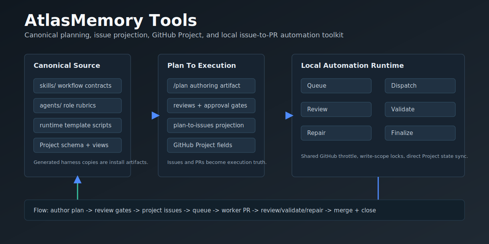

# AtlasMemory Tools



AtlasMemory Tools is the canonical planning, issue projection, GitHub Project, and local issue-to-PR automation toolkit used by AtlasMemory-style repos.

It owns four surfaces:

- `skills/`: workflow contracts for planning, review, implementation, issue projection, runtime setup/operation/upgrade, handoffs, and HTML plan review artifacts
- `agents/`: reusable specialist role rubrics for planning, implementation, review, validation, data, infra, processing, and testing
- `templates/local-automation-runtime/`: reusable local automation host for GitHub issue-to-PR execution
- `manifests/atlas-tools.v1.json`: supported harness adapters, canonical skills, agents, templates, and generated-copy inventory

The repo also carries shared `scripts/`, `docs/`, `tests/`, `examples/`, and committed generated `.cursor/` compatibility files.

## Mental Model

- This repo is the source of truth for shared instructions, scripts, Project schema helpers, and runtime templates.
- Generated harness files in downstream repos are install artifacts. Do not edit downstream `.codex/**`, `.cursor/**`, `.claude/**`, `.gemini/**`, or generated `AGENTS.md` copies as policy.
- An installed local automation runtime is operational state: local config, auth, logs, jobs, checkouts, locks, and validation artifacts.
- GitHub issues and PRs are execution truth. GitHub Projects are the portfolio/automation signal layer. Markdown plans remain the authoring surface until projection.
- Adding a target product repo usually means adding one line to a runtime `repos.txt`, not creating another runtime.

The checked-in `.cursor/` directory is retained as a generated compatibility copy. Update `skills/` or `agents/`, then regenerate and verify.

## Install

Generate harness files into a target repository:

```bash
python3 scripts/install_harness.py --harness cursor --target /path/to/project
python3 scripts/install_harness.py --harness codex --target /path/to/project
python3 scripts/install_harness.py --harness gemini --target /path/to/project
python3 scripts/install_harness.py --harness claude --target /path/to/project
```

Verify generated files have not drifted:

```bash
python3 scripts/verify_harness.py --target /path/to/project
```

Enforce the local source-of-truth relationship across registered project copies:

```bash
cp ssot-projects.example.json ssot-projects.local.json
python3 scripts/enforce_local_ssot.py --registry ssot-projects.local.json --install-hooks
python3 scripts/enforce_local_ssot.py --registry ssot-projects.local.json --repair
```

See `docs/source-of-truth.md` for the install, update, contribution, and local hook workflow.

## Verify

Run the repository-level release/copy gates before publishing or copying this toolkit:

```bash
python3 -m pip install -r requirements-dev.txt
python3 scripts/verify_repo.py
```

For a raw filesystem copy, either copy from git/tracked files only or first run the strict local-artifact gate:

```bash
python3 scripts/verify_repo.py --skip-tests --strict-copy
```

Runtime template tests live under `templates/local-automation-runtime/tests` and are included in `scripts/verify_repo.py`.
The verifier also checks committed harness freshness, adapter CLI generation, executable bits, JSON and Python syntax, placeholder leaks, and trailing whitespace.
`--strict-copy` is intentionally noisy in a dirty local tree; runtime-local files such as `config.env`, `repos.txt`, `projects.txt`, validation JSON, `.venv/`, caches, and generated job state must be excluded from raw copies.

## Quick Start

1. Use `plan` with a feature idea or existing plan file.
2. Use `review` / planning review skills until planning gates pass.
3. Use `github-project` when the work needs the standard execution Project board.
4. Use `plan-to-issues` when approved work should become GitHub issues and Project items.
5. Use `plan-to-html` when a markdown plan should be rendered into a standalone review artifact.
6. Use `implement` for approved plan execution.
7. Use `handoff` before pausing, resuming, or moving work between agents.
8. Use `local-automation-runtime-setup`, `local-automation-runtime-operate`, and `local-automation-runtime-upgrade` for runtime lifecycle work.

For full planning details, see `skills/plan/README.md`.

## Planning with Agentic Review Mode

Use `$plan` with agentic review mode.

That phrase is the preferred Codex-facing wrapper for the planning system. `$plan` remains the public workflow and the only authority that writes the selected plan artifact, updates decision logs, and changes gate or approval state. Agentic review mode is an optional review layer inside `$plan`: it snapshots the selected markdown plan, runs independent reviewer personas against the snapshot, collects structured findings or patch proposals, reconciles conflicts, asks the user for intent decisions, and routes accepted edits back through `$plan`.

Use it for all planning entrypoints:

- New work: `Use $plan with agentic review mode to plan <feature/goal>.`
- Old or messy plans: `Use $plan with agentic review mode to review @path/to/old.plan.md before trusting any existing pass/approval claims.`
- Previously planned plans: `Use $plan with agentic review mode to re-enter @path/to/plan.md, audit stale assumptions, and refresh the plan before projection or build.`
- Focused hardening: `Use $plan with agentic review mode to check CLI/UI separation, contract boundaries, integrity, evidence policy, and automation readiness in @path/to/plan.md.`

For Codex, the intended shape is:

```text
$plan
  -> selects or creates exactly one AuthoringArtifact
  -> runs normal planning gates and user Q/A
  -> optionally invokes agentic review mode
      -> local-plan-agent-runtime snapshots the plan
      -> independent personas review the snapshot
      -> proposals are validated and reconciled
      -> human-agency decisions are returned to the user
  -> $plan applies accepted edits
  -> $plan reruns affected gates/reviews
```

This works for new plans, old plans that are not in the current shape, and previously approved or reviewed plans. For old plans, `$plan` should not trust existing `Pass`, `Approved`, projection, or dispatch claims. It should perform a re-entry audit, identify which sections are missing or stale, and either repair the plan or keep the relevant gates failing.

Agentic review mode should interrogate the user when the plan is missing implementation-critical intent. It should ask targeted questions about the current workflow, desired workflow, scope, anti-scope, repo facts, file ownership, validation evidence, rollback, trust boundaries, and dispatch/projection policy. If the user does not answer a decision-bearing question, the plan should remain blocked instead of letting agents invent the answer.

The simplified skill hierarchy is:

- `$plan`: the single user-facing planning command and canonical writer.
- `local-plan-agent-runtime`: the internal agentic review mode used by `$plan` when parallel/local-file review is requested.
- `plan-execution-readiness`: the critical review checklist/persona used standalone or inside the runtime.
- `plan-stress-review`: legacy phrase/alias for `plan-execution-readiness`; do not add a separate workflow around it.

Keep these systems repo-first. Source skills, scripts, references, and runtime protocol files belong under this repo's `skills/` tree. Local Codex copies are install artifacts used for execution. Update the repo-native source first, then install or sync into the local Codex skill directory.

## Local Automation Runtime

The runtime template now supports the full unattended loop:

```text
reconcile -> decompose -> workstream-review -> dependency-promote ->
dispatch -> review -> semantic-review -> local/deployed validation -> repair -> finalize -> summary
```

Current runtime behavior includes:

- per-stage concurrency controls such as `--dispatch-max-per-repo`, `--semantic-review-concurrency`, `--local-validate-concurrency`, `--repair-concurrency`, and `--deployed-validate-concurrency`
- repo/base/write-scope locks so disjoint one-point issues can run in parallel while overlapping scopes wait
- pre-PR validation evidence gating so worker-published PRs include exact test/verification commands or an explicit validation waiver
- scheduler-facing decomposition metadata for dependencies, parallel groups, conflict classes, merge groups, combine policy, validation tier, and critical path ordering
- shared GitHub CLI throttling under `jobs/github-api-throttle/` to avoid GraphQL and secondary rate limits
- local-first unattended defaults, with GitHub Project sync moved to explicit `project-reconcile` stages or `--project-reconcile-every N` checkpoints
- Project item scans controlled by `AGENT_PROJECT_ITEM_LIMIT`, default `500`
- direct Project `AutomationState` updates for `Queued`, `Running`, `PR Open`, `Failed`, and `Done`
- decomposition metadata inheritance so child issues retain plan key, parent epic, gates, risk, validation scope, and priority context
- mandatory workstream completion bundles covering semantic review, garbage collection, docs updates or docs-not-needed rationale, validation evidence, and downstream readiness
- local Atlas work-item bootstrap dispatch via `--atlas-work-items`, which records claim/result evidence in a JSON work-item lifecycle without GitHub issue or PR mutation
- structured agent-role workflow templates via `TeamTemplate`/`TeamRun`, including dependency-aware role packets, consumed role outputs, and rollup evidence back onto the work-item lifecycle

See `templates/local-automation-runtime/README.md` and `templates/local-automation-runtime/SETUP.md`.

## Documentation Map

- `docs/source-of-truth.md`: canonical source and generated-copy workflow
- `docs/automation-runtime-operational-layer.md`: operational model for runtime hosts and GitHub state
- `docs/atlas-workflow-templates.md`: TeamTemplate/TeamRun model for structured agent-role workflows and rollup evidence
- `docs/github-project-template-views.md`: standard Project fields and view expectations
- `skills/plan/README.md`: human-facing `/plan` workflow
- `skills/plan-to-issues/README.md`: issue and Project projection workflow

## Examples

- `examples/generic/`: placeholder-safe runtime defaults for new projects
- `examples/atlasmemory/`: AtlasMemory-specific runtime examples with real org/project/check names
