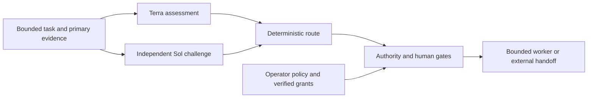

# Routing, independent challenge, and human authority

This update adds the decision layer in front of the bounded Azure worker. The
[implementation record](azure-dispatch-governance-plan-2026-09-08.md) captures the
approved scope. The [Azure operating contract](azure-devops-runtime.md) still
governs native dependencies, revisions, source isolation and publication.

## Decisions and enforcement



The assessment suggests a work class and identifies uncertainty. Fixed policy
determines the permitted route and model settings. Sensitive paths impose risk
floors. Missing dependency evidence, incomplete reads, pending human decisions,
or absent authority remain blockers regardless of model agreement. Story points
inform scope and decomposition; they cannot lower a risk floor or confer rights.

The dispatcher receives the namespaced issue and revision, bounded worker
packet, exact base and affected paths, applicable instructions, hashed source
and test evidence, current native dependency snapshot, human gate requirements,
point estimate, prior attempt evidence, budgets and selected policy. It reads
only named bounded files. It receives no credentials or permission to infer
missing acceptance criteria. Failed attempts justify escalation only when
candidate-bound command or review evidence demonstrates the failure.

The counterfactual challenge starts from the primary evidence in a separate
context. It checks whether a supposedly small change has wider effects, whether
a cheaper route or smaller task is sufficient, whether verification is adequate,
and whether a human decision has been mistaken for a technical question. It must
identify evidence and unknowns. It is not instructed to invent disagreement.

Technical disagreement allows a bounded evidence-driven reassessment. A missing
approval, unavailable environment, unanswered preference, or stale source does
not justify repeatedly calling a stronger model. Waiting and deterministic
status/dependency checks use no model. A routing result is a proposal until the
exact execution and human gates have been verified.

## Model policy

The existing Website runtime configuration retains `gpt-6-astra` / `max` for
planning, implementation, review and repair. An explicitly selected routing
policy supplies a different resolved configuration; it is displayed and bound
to the approval before execution. The application never substitutes a model
silently or edits the existing default to save cost.

The explicitly selected policy uses these starting assignments:

| Work | Model and reasoning |
| --- | --- |
| Initial assessment | `gpt-5.6-terra` / `medium` |
| Independent challenge and bounded reassessment | `gpt-5.6-sol` / `high` |
| Clear clerical work | `gpt-5.6-luna` / `low` |
| Routine bounded implementation | `gpt-5.6-terra` / `medium` |
| Planning and independent code review | `gpt-5.6-sol` / `high` |
| Sensitive or difficult work | Explicit stronger profile, including `gpt-6-astra` |

The Website example resolves the four worker roles as follows. Each cell is
model family / reasoning; the JSON uses the full model identifiers above.

| Profile | Planning | Implementation | Review | Repair |
| --- | --- | --- | --- | --- |
| Clerical | Terra / medium | Luna / low | Sol / high | Terra / medium |
| Routine | Sol / high | Terra / medium | Sol / high | Terra / high |
| Complex | Sol / high | Terra / high | Astra / high | Sol / high |
| Sensitive | Astra / high | Astra / high | Astra / max | Astra / high |

These assignments follow the distinctions in the
[official model guidance](https://learn.chatgpt.com/docs/models). They require
representative pilot evaluation; published availability is not proof of access
or successful execution by this runtime. Qualification should measure accepted
results, missed defects, false blocks, repairs, human effort, observed usage and
elapsed time. A lower token price does not establish a lower cost per accepted
task. Hard call/attempt/time/input limits must be distinguished from estimated
token or currency budgets that the CLI cannot enforce before a response.

Each call records its role, model, reasoning, actual argument vector, CLI
preflight result, context hash and observed usage. Assessment and challenge use
different scratch directories. The parent withholds the primary result from
the challenge's supplied context and journal until the blind challenge finishes;
an interrupted call remains uncertain and is not automatically replayed. This
is context separation: `workspace-write` does not provide OS read isolation
against a process already running as the same identity.

## Human steps

Each gate identifies its owner, a concise question, the action it blocks, and the
exact task revision, candidate or artifact under review. Requirements can apply
before implementation, before publication, or before final acceptance. A visual
acceptance gate after implementation must not prevent earlier authorized local
preparation; it must prevent unsupported completion.

Human decisions require verified receipts. A worker's JSON saying
`human_accepted: true`, a prose issue comment, a copied old approval, a successful
test command, or an unverified uploaded receipt cannot replace that evidence.
Changed revisions, candidates, artifacts or gate requirements invalidate reuse.
Rejected feedback remains pending; revised work requires an explicit updated
intake and matching authority. It never creates an automatic repair job or
implies acceptance. Missing responses remain pending without model polling.

Post-preparation receipts travel separately from the prepared worker
configuration. Publication authority binds their digest as well as the exact
candidate and acceptance evidence. A deferred gate retains its template hash,
owner, question and action when the candidate is filled in. Adding a response
must not change the selected models or silently replace the original gate.

For required input before assessment, include the accepted answer as primary
evidence with ID `human-answer:<gate-id>`, exact issue revision, and canonical
JSON content `{"gate_id":"...","response":"..."}`. Its content hash must match,
and the separately verified receipt must attest that same response. Adding or
changing an answer creates a new intake and assessment grant; the original gate
and worker packet remain intact. Both independent model contexts receive that
same answer evidence, and the worker receives the verified answer.

Website pipeline runs, Environment approvals, PR approval, merges, deployments
and service-connection operations remain external/human work under the Website
authority contract. This update can describe and track those steps and consume
verified evidence. It does not add commands that perform the prohibited action.

## Trusted approval boundary

The authority verifier checks signatures against public issuer material in the
fixed `<runtime-dir>/authority/trust.json` registry. This path is outside all
agent worktrees. Registry provisioning and issuer enrollment are operator
actions requiring separate installation/setup authorization. No preview creates
the registry; no production runtime command creates signing keys or issues grants.

The selected runtime must be owned by this identity, outside Git checkouts and
agent worktrees, with no writable-by-others or symlinked ancestry. A source
template path can support an inert preview while being unsuitable for enrolled
execution. Installation must select a compliant location; the runtime never
changes host directory permissions to make a check pass.

Issuer enrollment is the trust root: the operator must establish which public
key represents which authorized person or approval service, its permitted
actions, the governing policy and revocations. A mathematically valid signature
from an unknown or self-enrolled key supplies no authority. The registry and
signing infrastructure must remain outside agent write access. A signature
establishes the enrolled issuer's attestation; the issuer must actually enforce
human identity, role and consent when those are required.

The verifier uses the installed OpenSSL executable with public keys, explicit
SHA-256 and a bounded sanitized process. The implementation does not read or
persist signing secrets. See the
[OpenSSL signature-verification interface](https://docs.openssl.org/3.5/man1/openssl-dgst/).
Missing OpenSSL or trust material blocks actions rather than installing tools.

Grants bind the issuer, validity period, runtime, policy,
operation and exact typed task/configuration bindings. Publication additionally
binds the candidate and acceptance evidence; reconciliation binds the exact
proposal. Changing models, policy, source or operation requires corresponding
authority. The verifier runs in the action path, including direct CLI/API calls,
so bypassing the dispatcher cannot bypass authorization. It checks the current
registry's revocations and accounts for elapsed verification time before
accepting a grant.

Previous local approval strings and proposal hashes remain useful references
but no longer authorize execution by themselves. Migrate by preparing the exact
bindings, having the enrolled operator approve them through the trusted issuer,
and supplying the resulting signed grant. No approval is imported automatically.
Authorization at the tool/backend boundary follows
[OWASP guidance](https://genai.owasp.org/llmrisk/llm062025-excessive-agency/).

### Public trust and signed envelope format

The registry is schema `1`, with the exact absolute `runtime_dir`, governing
`policy_sha256`, an `issuers` object keyed by issuer ID, and `revoked_grants`.
Each issuer records `subject`, `algorithm: "rsa-sha256"`, `public_key_pem`,
allowed `actions`, and `revoked`. The verifier accepts RSA SPKI public keys with
2048–8192-bit moduli and rejects one key assigned to different human subjects.
Key rotation for the same subject can use separate issuer entries.

The grant envelope has exactly `schema`, `issuer`, `algorithm`, `payload`, and
`signature`. Its payload has exactly `schema`, `grant_id`, `issued_at`,
`not_before`, `expires_at`, `runtime_dir`, `policy_sha256`, `action`, and
`bindings`. Times are integer Unix seconds, expiry is exclusive, and validity
cannot exceed 24 hours. The base64 signature uses RSA PKCS#1 v1.5 with SHA-256
over the entire envelope except `signature`, serialized as UTF-8 JSON with
sorted keys, compact separators, and `ensure_ascii=False`. Duplicate keys and
nonfinite numbers are rejected. A digest uses this same canonical encoding.

Permitted grant actions are `assess`, `local_execute`, `draft_pr`, `board_write`,
and `human_gate`. There is no deployment, workflow approval, merge or permission
grant type. Exact action bindings come from the command's preview or binding
helper; do not hand-edit or reuse another operation's bindings. The authority
module and its public fixtures document the strict format without providing a
production signer or enrollment shortcut.

A human receipt contains exactly `gate_id`, `decision`, `response`, and `grant`.
`decision` is `accepted`, `rejected`, or `feedback`; only accepted receipts can
satisfy a gate. The signed `human_gate` bindings include the gate and response
digests, packet, native issue ID and revision, candidate, artifact and requested
action. The enrolled issuer's subject must equal the gate owner. The separate
operation grant is still required after a human gate has been satisfied.

## Inert routing pilot

From the AtlasMemory-Tools checkout, this command reads the checked-in synthetic
example and reports its model policy and blockers. It performs no authentication,
model call, state write or API request:

```bash
python3 -B templates/local-automation-runtime/atlas-agent-azure-dispatch \
  --config examples/instablinds/local-automation-runtime/config/azure-website.json \
  --runtime-dir /home/instablinds-admin/code/AtlasMemory-Tools/templates/local-automation-runtime \
  --policy examples/instablinds/local-automation-runtime/config/azure-website-routing.json \
  --intake examples/instablinds/local-automation-runtime/routing-intake.example.json \
  --snapshot examples/instablinds/local-automation-runtime/routing-snapshot.example.json \
  --dry-run
```

Expect `inert: true`, `dispatched: false`, `completion: false`, an empty `effects`
list and a blocked decision. The examples intentionally contain stale, synthetic
evidence and incomplete dependencies. They cannot be used for dispatch.

The [inspection pilot](azure-devops-runtime.md#inspection-and-previews) remains
the next step for reviewing actual Board and repository evidence. No installation
is needed to run either offline preview. Wrapper `--dry-run` prints the proposed
command without invoking the runtime; the direct entrypoint above evaluates the
offline inputs.

## Authorized operation and human resume

After separately authorized installation and issuer enrollment, the operator
enables only the needed capabilities in a reviewed configuration. Replace the
synthetic intake with complete fresh evidence and an exact bounded worker
packet. Use `--context-root` for verifying referenced source files. The source
configuration's original four model settings remain visible beside the proposed
resolved settings.

1. Preview the intake and exact assessment bindings. Optional `--assessment`
   and `--challenge` JSON are what-if inputs accepted only in previews.
2. Run `--assess --authorization <signed-assess.json>` with the reviewed inputs.
   Required human input also needs `--human-receipts <receipts.json>`. Approval
   of local execution is a later gate; it need not prevent separately authorized
   assessment. A successful report exports `routing_provenance`, the resolved
   configuration and digest, actual call receipts and observed budget. Preserve
   these exact values for review.
3. With separate `local_execute` capability and a signed grant for the resolved
   configuration and worker packet, invoke `--execute`. It uses parent-recorded
   assessment evidence; caller-supplied model JSON cannot replace a real
   assessment. Direct routed worker execution verifies the same prerequisite.
   Preparation records a candidate and acceptance evidence, never completion.
4. Human status can be checked with `--check-handoff --human-receipts
   <receipts.json>`, optionally `--handoff-stage before|after` and
   `--handoff-action <action>`. This explicitly verifies signatures using
   OpenSSL, with no model call, network request, state write, workflow action or
   completion claim. Ordinary previews never invoke that verifier.
5. When separately authorized, use the worker's `--publish`, the preserved
   `--routing <provenance.json>`, a new exact `draft_pr` grant and any
   `--human-receipts`. The new grant binds the prepared candidate, acceptance
   evidence, receipt digest and original gate templates. If human review
   outlasts the routing freshness window, only the intact prepared claim may
   supply historical routing proof. Current policy, grant, human decisions,
   Board dependencies and source/candidate checks remain mandatory.

Call and attempt reservations survive restarts and new grants. Missing output,
unknown usage, interrupted work and uncertain claims stop further work instead
of claiming success or resetting budgets. The bounded worker accounts for its
planning, implementation, review and optional repair/review calls in the same
ledger as assessment. Token admission uses observed usage and can overshoot on
the final call; there is no claimed hard CLI token or currency cap.

## Qualification and operational limits

The 53 applied rollout dependency links remain intact. The other 18 prerequisite
edges remain outside that authorization. The comparison fixture is unapproved,
and the Website runtime configuration still enables reads only. Model routing
does not change dependency completeness, release readiness or execution rights.

Local tests and public synthetic signature fixtures establish implementation
behavior. They do not establish an installed runtime, enrolled real approver,
working model account, qualified live sandbox, published PR or accepted release.
Installation, trust enrollment, a real assessment canary, local worker dispatch,
draft publication and Board reconciliation require their own exact authority.
The [validation receipt](azure-dispatch-governance-validation-2026-09-08.md)
records the test commands, review findings and their practical limits.

Rollback restores only reviewed source/template files. Preserve operator trust,
grants, decisions, claims, human receipts, worktrees and API throttle state.
Never re-enable plain self-asserted approvals as a recovery fallback.
